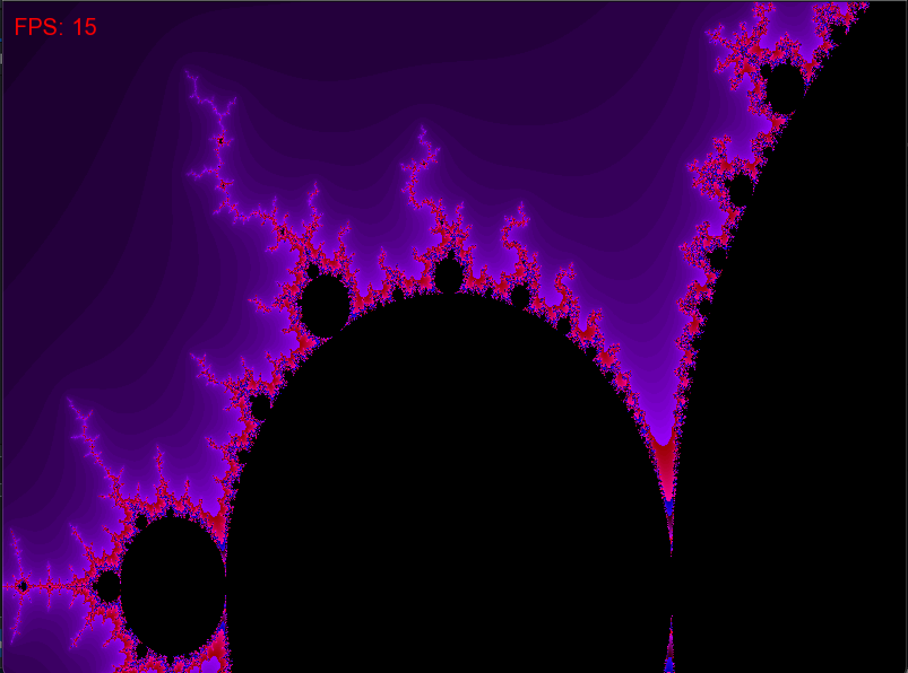
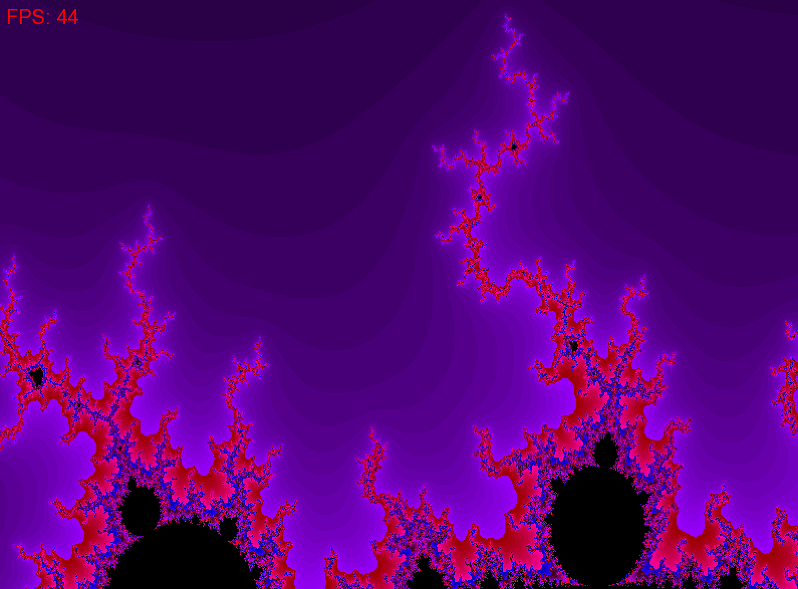

## Использование инструкций SSE (Streaming SIMD Extensions) для ускорения вычислений в программе

### Задание
Исследовать влияние применения SSE (Streaming SIMD Extensions) инструкций на производительность программы алгоритма построения множества Мандельброта. Ожидается, что использование SSE инструкций улучшит эффективность вычислений. Для наглядности результаты визуализируются с помощью SFML.

### Введение
Так как у меня процессор Intel Core i7, то он поддерживает SSE-инструкции.

Инструкции SSE (Streaming SIMD Extensions) предоставляют SIMD (Single Instruction, Multiple Data) возможности для ускорения параллельной обработки данных на процессорах Intel. SSE инструкции позволяют выполнять одну операцию над несколькими данными одновременно.

Для измерения производительности используется инструкция rdtsc, которая подсчитывает количество тактов процессора, затраченных на выполнение определенной части кода. Функция вывода изображения отключается во время замеров, чтобы сравнивать именно затраты времени на вычисление множества, а не на отрисовку. Применяется функция __rdtsc() в языке программирования С++, которая предоставляет доступ к инструкции rdtsc.

Визуализация отрисовки фрактала Мандельброта:







### Запуск программы
```
make
./app
```

### Флаги компиляции, используемые в задании
-O0 (Отсутствие оптимизаций):
Этот флаг указывает компилятору g++ не выполнять практически никаких оптимизаций при компиляции.

-O3 (Высокий уровень оптимизации):
Этот флаг указывает компилятору на максимальный уровень оптимизации кода.
Компилятор будет производить различные виды оптимизаций, включая инлайнинг функций, удаление недостижимого кода, улучшение распределения регистров, развертывание циклов и т. д.


### Первая программа
Используются обычные операции над числами одинарной точности (float)

Время:
- 545786612 (-O0)
- 258017412 (-O3)

### Вторая программа
В этой программе в основном цикле каждая итерация обрабатывает четыре точки одновременно, что позволяет использовать векторизацию данных и распараллеливать вычисления между ними. Используются обычные операции над числами одинарной точности (float). В этом коде используются локальные массивы для хранения векторов

В целом, этот код обеспечивает параллельное вычисление фрактала Мандельброта для нескольких точек одновременно, используя простые операции и минимизируя операции загрузки/выгрузки данных из памяти.

Время:
- 1177766041 (-O0) ПИЗДЕЦ КАКОЙ-ТО
- 115149833  (-O3)

### Третья программа
В коде определены функции (mm_set_ps, mm_set_ps1, mm_cpy_ps, mm_add_ps, mm_sub_ps, mm_mul_ps, mm_add_epi32, mm_cmple_ps, mm_movemask_ps), которые выполняют различные операции над векторами и массивами, позволяя упростить код и повысить его читаемость. Код использует массивы для хранения координат X и Y нескольких точек фрактала одновременно, что позволяет проводить параллельные вычисления и ускоряет процесс генерации фрактала.

Время:
-
-

### Четвертая программа
Регистры, используемые в этом коде, - это регистры XMM (размером 128 бит). Они используются для хранения векторов одинарной точности и для выполнения SIMD-инструкций.

SIMD (Single Instruction, Multiple Data): SIMD позволяет одной инструкции выполнять одну операцию над несколькими данными сразу. В этом коде используются 128-битные регистры SIMD (такие как __m128), которые содержат четыре числа одинарной точности.

Вместо обработки каждого элемента по отдельности, как это было бы в скалярной реализации, здесь операции производятся сразу над четырьмя числами одновременно, что повышает производительность.

Векторные инструкции, такие как _mm_mul_ps (умножение двух векторов), _mm_add_ps (сложение двух векторов), _mm_sub_ps (вычитание двух векторов) используются для выполнения вычислений над несколькими числами одновременно.

Этот код использует параллельные вычисления для ускорения процесса вычисления фрактала Мандельброта. Каждая итерация цикла обрабатывается независимо друг от друга, что позволяет распараллелить вычисления.

Время:
- 343013129
- 78251907

|     version    |    name    | Compilation flags |   ticks    | Speed Growth calculated with rdtsc | FPS   | Speed Growth calculated with clock |
|:--------------:|:----------:|:-----------------:|:----------:|:----------------------------------:|-------|:----------------------------------:|
|      base      | main1.cpp  |        -O0        | 545786612  |                                    | 4.68  |                  1                 |
|      base      | main1.cpp  |        -O3        | 258017412  |                                    | 9.42  |                2.01                |
| vectorized(4x) | main2.cpp  |        -O0        | 1177766041 |                                    | 2.13  |                0.46                |
| vectorized(4x) | main2.cpp  |        -O3        | 115149833  |                                    | 20.89 |                4.46                |
| vec(4x) + func | main3.cpp  |        -O0        | ?          |                                    | ?     |                 /                  |
| vec(4x) + func | main3.cpp  |        -O3        |  ?         |                                    | ?     |                 /                  |
| SIMD optimized | main4.cpp  |        -O0        | 343013129  |                                    | 7.21  |                1.54                |
| SIMD optimized | main4.cpp  |        -O3        |  78251907  |                                    | 30.23 |                6.45                |

### Вывод
Сравнение производительности четырех программ, реализующих алгоритм построения множества Мандельброта, показывает значительное преимущество использования инструкций SSE (Streaming SIMD Extensions).

Сравнивая результаты, можно увидеть, что использование инструкций SSE (четвертая программа) демонстрирует лучшую производительность и быстродействие по сравнению с другими подходами. Это происходит за счет эффективного использования векторизации данных и параллельных вычислений, что позволяет обрабатывать несколько элементов одновременно и значительно сокращает время выполнения алгоритма.
